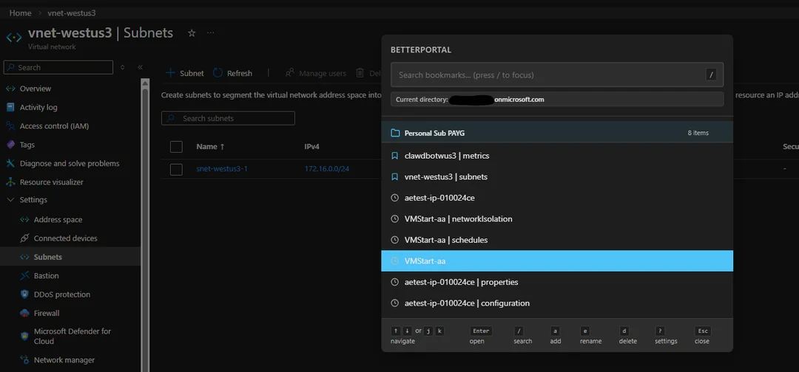
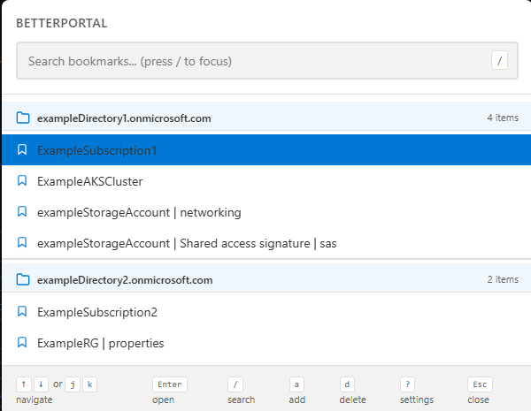
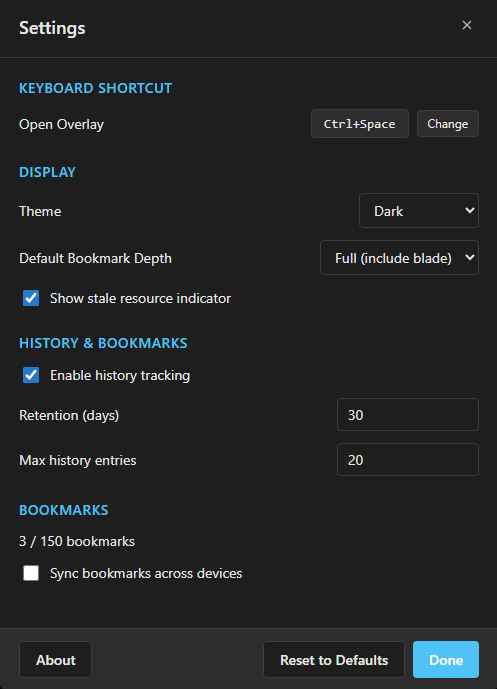

# BetterPortal

Fast Azure portal navigation with bookmarks, history, and cross-device sync.

> **Open Source** | Privacy-focused | All data stored locally or synced via your Chrome account

**Install:** [Chrome Web Store](https://chromewebstore.google.com/detail/betterportal/lfncmeppbeoclipcofoecmiokloajbaa) | [Firefox Add-ons](https://addons.mozilla.org/en-US/firefox/addon/betterportal-azure/)



## Features

- **Quick Access Overlay**: Press `Ctrl+Space` to open a command palette-style overlay
- **Bookmarks**: Save Azure resources with one-click navigation and inline rename
- **Bookmark Sync**: Optionally sync bookmarks across devices via your Chrome account (up to 150 bookmarks)
- **History**: Auto-capture visited resources with copy-to-clipboard support
- **Import/Export**: Backup and restore bookmarks as JSON
- **Vim-style Navigation**: `j`/`k`, `gg`/`G`, `Ctrl+D`/`Ctrl+U` for fast navigation; `y` to copy URL; `o` to open in new tab
- **Multi-tenant Support**: Automatic directory switching when navigating
- **Directory Aliases**: Rename tenant directories with friendly names
- **Current Directory Display**: Overlay header shows which Azure directory you're in

| Bookmarks | Settings |
|:-:|:-:|
|  |  |

## Installation

### Development

```bash
# Install dependencies
npm install

# Build for Chrome (default)
npm run build

# Build for Firefox
npm run build:firefox

# Build both
npm run build && npm run build:firefox

# Run tests
npm test
```

### Load in Chrome

1. Run `npm run build` to create the `dist/` folder
2. Open Chrome → `chrome://extensions`
3. Enable "Developer mode" (toggle in top right)
4. Click "Load unpacked" and select the `dist/` folder
5. Navigate to `portal.azure.com` and press `Ctrl+Space`

### Load in Firefox

1. Run `npm run build:firefox` to create the `dist-firefox/` folder
2. Open Firefox → `about:debugging#/runtime/this-firefox`
3. Click "Load Temporary Add-on"
4. Select any file inside the `dist-firefox/` folder
5. Minimum Firefox version: **128** (June 2024)

## Usage

### Keyboard Shortcuts

**Fixed keys** (always active, not remappable):

| Key | Action |
|-----|--------|
| `Ctrl+Space` | Open / close overlay (default — remappable in Settings) |
| `↑` / `↓` | Navigate up / down |
| `j` / `k` | Navigate down / up (vim) |
| `gg` | Jump to first item |
| `G` | Jump to last item |
| `Ctrl+D` | Jump down 5 items |
| `Ctrl+U` | Jump up 5 items |
| `Enter` | Open selected item |
| `Esc` | Close overlay / exit search |

**Configurable keys** (defaults shown — change in Settings → Keybinds):

| Default | Action |
|---------|--------|
| `/` | Focus search |
| `a` | Bookmark current page, or promote history item to bookmark |
| `d` | Delete selected item |
| `e` | Edit / rename selected bookmark or directory header |
| `?` | Open settings |
| `y` | Copy URL of selected item |
| `t` | Open selected item in new tab |

### Bookmarks

- Press `a` on any Azure resource page to save a bookmark
- Bookmarks include the tenant context for automatic directory switching
- Choose between "full" state (includes blade) or "resource only" depth
- Press `e` on a selected bookmark to rename it inline
- **Sync**: Enable bookmark sync in Settings to keep bookmarks in sync across all your Chrome devices (up to 150 bookmarks). When the limit is reached, an error banner is shown in the overlay.
- Bookmarks are grouped by directory; press `e` on a directory header to assign it a friendly alias

### History

- Automatically captures visited Azure resources
- Select a history item and press `a` to promote it to a bookmark
- Click the copy icon on any history item to copy its URL to clipboard
- Configurable retention period (default: 30 days)
- Configurable max history entries (default: 20, range: 1-5000)

### Import/Export

- Click the extension icon to access import/export
- **Export Data**: Download all bookmarks as JSON
- **Import Data**: Upload previously exported bookmarks
- Useful for backup, migration, or sharing bookmarks

## Tech Stack

- **UI**: Svelte 4
- **Build**: Vite + vite-plugin-web-extension
- **Language**: TypeScript
- **Testing**: Vitest + Testing Library
- **Extension**: Chrome & Firefox Manifest V3

## Project Structure

```
src/
├── background/          # Service worker
├── content/             # Content script (overlay injection)
├── features/
│   ├── overlay/         # Main overlay UI
│   ├── bookmarks/       # Bookmark management
│   ├── history/         # History tracking
│   └── settings/        # Settings management
├── popup/               # Extension popup
├── shared/              # Shared types, storage, constants
└── styles/              # Global styles
```

## Configuration

Settings are accessible via:
- Extension popup (click extension icon)
- Overlay settings (`?` key)

Configurable options:
- Hotkey customization
- Theme (Light, Dark)
- History enable/disable
- History retention period
- Max history entries
- Bookmark sync (enable cross-device sync via Chrome account)
- Bookmark count display

## Development

### Adding Tests

Tests are co-located with source files:

```bash
src/features/bookmarks/url-parser.ts
src/features/bookmarks/url-parser.test.ts
```

Run tests:
```bash
npm test           # Watch mode
npm run test:watch # Explicit watch mode
```

### Building

```bash
npm run build           # Chrome → dist/
npm run build:firefox   # Firefox → dist-firefox/
```

### Firefox Release (AMO)

```bash
npm run build:firefox          # build the extension
npm run lint:firefox           # check AMO compliance
npm run package:firefox        # create .xpi in web-ext-artifacts/
```

Submit the `.xpi` to [addons.mozilla.org](https://addons.mozilla.org).
Mozilla requires a source code zip alongside minified builds — attach the repo source zip to the submission.

## Contributing

Contributions are welcome! Here's how you can help:

### Reporting Issues
- Use GitHub Issues to report bugs or request features
- Include steps to reproduce, expected vs actual behavior
- Screenshots are helpful for UI issues

### Pull Requests
1. Fork the repository
2. Create a feature branch (`git checkout -b feature/amazing-feature`)
3. Write tests for your changes (see `CLAUDE.md` for testing guidelines)
4. Ensure tests pass (`npm test`)
5. Commit with clear messages
6. Push to your fork and submit a PR

### Development Guidelines
- See `CLAUDE.md` for architecture patterns and learnings
- Follow existing code style (TypeScript + Svelte)
- Add tests for bug fixes and new features
- Keep commits focused and atomic

## Roadmap

### Current (v1.x)
- ✅ Local bookmarks and history
- ✅ Multi-tenant support with automatic directory switching
- ✅ Customizable hotkeys
- ✅ Dark/Light themes
- ✅ Export/import bookmarks
- ✅ Inline bookmark rename
- ✅ Directory aliases (rename tenant directories with friendly names)
- ✅ Bookmark sync across devices via Chrome account
- ✅ Current directory display in overlay header
- ✅ Copy-to-clipboard for history items and directory headers
- ✅ Configurable history limit and retention

- ✅ Firefox support (Firefox 128+)

### Planned
- 🔄 Advanced filtering and tagging
- 🔄 Edge support

**Note:** The core extension will remain free and open source.

## Troubleshooting

### Bookmarks navigating to the wrong tenant

Occasionally a bookmark may be saved with an incorrect or missing tenant GUID, causing cross-tenant navigation to fail or land in the wrong directory. This can happen when:

- The Azure Portal's internal state was stale at the time the bookmark was saved (e.g., shortly after switching directories)
- No OAuth token fetch was intercepted for that session, so the extension fell back to less reliable detection methods

**Automatic recovery (for missing GUIDs only):** Simply navigate to the affected tenant via a URL that includes the GUID in the path (e.g., from an email link or another cross-tenant bookmark that works). The extension will detect the GUID and automatically backfill any same-tenant bookmarks that are missing it.

**Manual fix (for wrong GUIDs, or when automatic recovery doesn't help):**

1. Navigate to the affected tenant in Azure Portal and note the GUID in the URL: `portal.azure.com/{GUID}/...`
2. Click the extension icon and export all your bookmarks as JSON (Export Data)
3. Open the JSON file and update the `tenantId` field to the correct GUID for each affected bookmark
4. Delete the affected bookmarks (or all bookmarks if fixing multiple tenants)
5. Re-import the modified JSON file

The import stores the `tenantId` you provide directly, so the corrected values will be used immediately for all future navigation.

## Privacy

- **No telemetry or analytics** - we don't track you
- **No external servers** - all data stored locally in Chrome storage (or optionally Chrome sync storage, which is managed by Google)
- **No data collection** - bookmarks and settings stay on your machine
- **Bookmark sync is opt-in** - disabled by default; enabling it stores bookmarks in `chrome.storage.sync` (Google's infrastructure)
- **Open source** - audit the code yourself

**Full Privacy Policy:** [PRIVACY.md](PRIVACY.md)

## License

MIT - See [LICENSE](LICENSE) file for details
